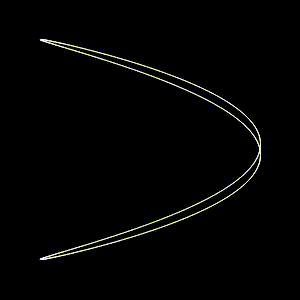

# Lissajous Curve

This code uses the `pygame` library to create a simple animation of a Lissajous curve. The parameters of the curve can be adjusted to change its appearance.

## Requirements

- Python 3
- pygame
- numpy

## Usage

To run the code, simply execute the `main.py` script:

python main.py

## Customization

The parameters of the Lissajous curve can be adjusted by modifying the values of the `a`, `b`, and `phi` variables at the top of the `main.py` script.

## License

This code is available under the MIT License. See the [LICENSE](LICENSE) file for details.
